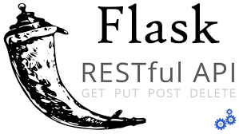

# property_prediction_api
A Flask API that predict properties's price with lineer regression.

An API published by [@kivancgunduz](https://www.linkedin.com/in/kivancgunduz35/) on [Heroku](https://property-prediction-api.herokuapp.com/).

#### Specification
```
- Ubuntu 18.04
- Pyhton 3.8
- Flask
- Docker
- Heroku
- Scikit-learn
```
#### Endpoints

- GET /
- GET /predict
- POST /predict
- Check Json schema -> [JSON FORMAT](https://github.com/kivancgunduz/property_prediction_api/blob/main/data/schema.json)

#### Installation Project

- ` git clone` [GitHub](https://github.com/kivancgunduz/property_prediction_api)
- ` cd property_prediction_api`
- ` pip install -r requirements.txt`
- ` python app.py`


#### Project Information

- Solo Project
- Deadline: **01.04.2022** - **16.00**
- Contributors: **Kivanc Gunduz**

#### Technologies

    
    


